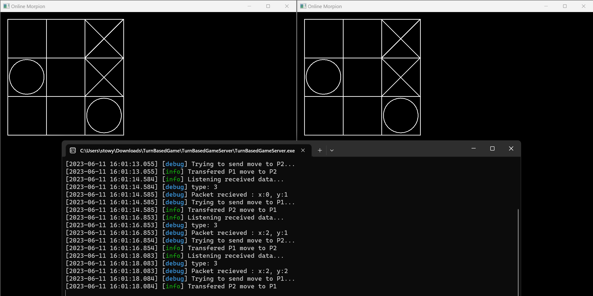

import Button from "../../components/Button.astro";

During the **networking** module at SAE Institute, the goal was to make a **Rollback Online Game**.
But first, we did smaller projects to learn how networking works.

The first thing we did was to implement was a small **chat app**.
For this, I used [Dear ImGui](https://github.com/ocornut/imgui) for the user interface
and [SFML](https://www.sfml-dev.org/) to be able to use sockets.

We then had to do a **turn-based game**.
I decided to implement a **Tic-Tac-Toe**.
In this one I also used SFML for the graphics and not just the networking.

After that we started the big final project.
The task was to develop a game using the **rollback engine** of our teacher.
So I decided to redo a jam game, [**Atomic Ball**](./atomic-ball), using SFML.

To do that, I first added and modified my [**physics engine**](./physics-engine) to the project.
This is necessary because of how rollback works.
Then, I built the rest of the game.

Using the engine was really hard, the API was really complicated and it required a lot of boilerplate code to add really simple thing.
Also, the final game sometimes has random crashes that I wasn't able to solve.
But in the end, I'm quite proud of the work I did and it was really interesting to learn how to do
reliable data transfer using UDP.

I wrote a blog post where I explained broadly how the online in the game works :
[Rollback Netcode in Atomic Ball](https://blog.stowy.ch/posts/rollback-netcode-in-atomic-ball/)

## What I Learned

-   **How Networking works**: During the networking module at SAE we were introduced to the OSI model and how TCP / UDP work.
-   **How to do Rollback Netcode**: We also looked at how various games implement their onlines and we then used a rollback networking engine made by our teacher.
-   **Using a custom physics engine in a game**: For rollback to work properly, we had to take our physics engine and use it in a real game.

	<video width="640" height="480" loop muted autoplay controls>
		<source src="/networking/atomicDemo.mp4" type="video/mp4" />
		Your browser does not support the video tag.
	</video>

	<Button href="https://github.com/St0wy/rollback-atomic-ball">
		Github Page
	</Button>

